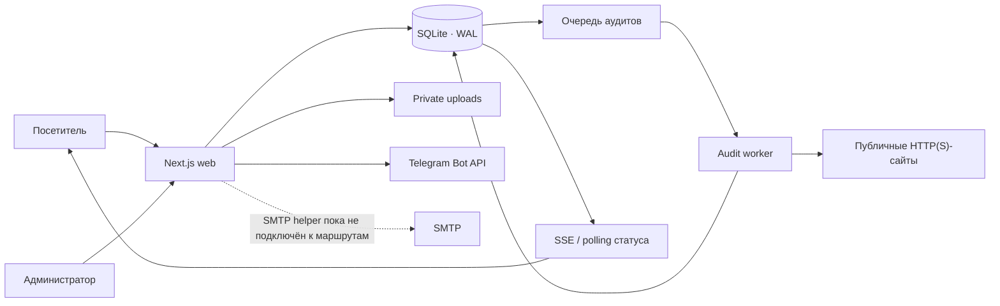

# Архитектура KILENI

## Назначение

KILENI — двуязычный сайт SEO-агентства на Next.js с публичными страницами, формами, бесплатным автоматическим аудитом, очередью фоновых задач и закрытой административной частью. Приложение рассчитано на один экземпляр веб-сервера и один экземпляр воркера, использующие одну SQLite-базу и одно приватное файловое хранилище.

## Контур системы

В Docker Compose база, вложения и локальные резервные копии находятся в общем томе `kileni_data`, смонтированном как `/data`. Вне контейнера пути задаются через `DATABASE_PATH`, `PRIVATE_UPLOADS_PATH` и `BACKUP_PATH`.

## Компоненты

### Web

- `app/` — App Router, публичные страницы, административные страницы и HTTP API.
- `src/components/` — интерфейс, формы, страницы и layout-компоненты.
- `src/content/` — русские и английские тексты услуг, кейсов, статей и брифов.
- `src/config/` — цены, калькулятор, контакты и общие параметры.
- `proxy.ts` — язык запроса и защитные HTTP-заголовки.

Web обрабатывает формы, создаёт записи в SQLite, принимает приватные вложения, выдаёт ограниченный публичный результат аудита по непрогнозируемому токену и обслуживает админку.

### Очередь и воркер

- `src/db/queries.ts` — постановка аудита в очередь, атомарный захват следующей задачи, события, завершение и heartbeat.
- `worker/index.ts` — цикл фоновой обработки и корректная остановка процесса.
- `src/lib/audit/` — нормализация URL, SSRF-защита, безопасный HTTP-клиент, robots/sitemap discovery, crawler, анализ и scoring.

Очередь хранится в таблице `audits`. Захват задачи выполняется под `BEGIN IMMEDIATE`, поэтому два воркера не должны обработать одну запись одновременно. Текущая эксплуатационная конфигурация всё равно предполагает один воркер: это проще для контроля исходящего трафика и нагрузки на SQLite.

### Данные

Основные таблицы определены в `src/db/schema.ts`, а начальная SQL-миграция — в `src/db/migrations.ts`.

- `audits`, `audit_pages`, `audit_issues`, `audit_events` — очередь, полный результат и поток статусов.
- `leads`, `calculator_requests`, `brief_submissions`, `attachments` — заявки и вложения.
- `admin_notes` — заметки администратора.
- `rate_limits` — локальные счётчики ограничений.
- `notification_events` — результат отправки Telegram-уведомлений.
- `worker_state` — heartbeat воркера.

SQLite работает с `journal_mode=WAL`, включёнными внешними ключами и `busy_timeout`. Приватные файлы не размещаются в `public/`; API отдаёт их только после проверки административной сессии.

## Основные сценарии

### Бесплатный аудит

1. Браузер получает CSRF-токен через `GET /api/csrf`.
2. `POST /api/audits` проверяет Origin, CSRF, rate limit, данные формы и публичность целевого адреса.
3. При наличии свежего завершённого результата для домена создаётся отдельная запись с безопасно переиспользованным результатом. Иначе задача получает статус `queued`.
4. Воркер атомарно забирает задачу, пишет этапы в `audit_events`, выполняет ограниченный обход и сохраняет полный и публичный результаты раздельно.
5. Страница `/audit/{publicToken}` получает изменения через SSE; при разрыве соединения используется polling.

Публичный токен не заменяет авторизацию для внутренних данных: публичный API не должен отдавать контакты, полный список URL, доказательства или внутренние ошибки.

### Заявка или бриф

1. Мутация проходит Origin/CSRF, honeypot, Zod-валидацию и rate limit.
2. Заявка записывается в SQLite.
3. Вложения брифа проверяются по расширению, MIME и сигнатуре, получают случайное имя и сохраняются вне `public/`.
4. Telegram-уведомление выполняется после сохранения. Ошибка Telegram не отменяет принятую заявку и фиксируется в `notification_events`.

### Администрирование

Администратор входит по логину и bcrypt-хешу пароля. Подписанная HMAC-сессия хранится в cookie `HttpOnly`, `SameSite=Strict`, а в production также `Secure`. Админка читает заявки, аудиты и вложения; изменения и удаления дополнительно проходят Origin/CSRF.

## Границы масштабирования

- SQLite и локальные вложения требуют общего файлового тома и не подходят для независимого горизонтального масштабирования web-реплик.
- Нельзя размещать SQLite на NFS-подобном хранилище без подтверждённой поддержки блокировок и WAL.
- Для нескольких web/worker-реплик потребуются внешняя транзакционная база, объектное хранилище, распределённый rate limit и отдельная очередь.
- SMTP-модуль существует, но маршруты заявок сейчас его не вызывают.
- `AUDIT_RESULT_RETENTION_DAYS` определён в конфигурации, но автоматическая очистка по сроку хранения пока не реализована.

## Связанные документы

- [Развёртывание](deployment.md)
- [Безопасность](security.md)
- [Резервное копирование](backup-and-restore.md)
- [Карта контента](content-map.md)
