# KILENI: что изменилось до и после редизайна

Дата фиксации: 16 августа 2026 года.

## Основание сравнения

Сравнение сделано по сохранённым полноразмерным скриншотам текущего проекта. Исходное состояние находится в [`redesign-screenshots/before/`](./redesign-screenshots/before/), итоговое — в [`redesign-screenshots/after/`](./redesign-screenshots/after/). Скриншоты не являются сторонними референсами: это фактические состояния KILENI до и после изменений.

Редизайн не заменял проект новым статическим макетом. Сохранены рабочие маршруты, реальный crawler, формы, admin-контур, RU/EN-локализация и существующие бизнес-данные. Перестроены визуальная иерархия, порядок блоков и пользовательские сценарии.

## Главная: от большой анкеты к понятному первому шагу

| До | После |
| --- | --- |
| 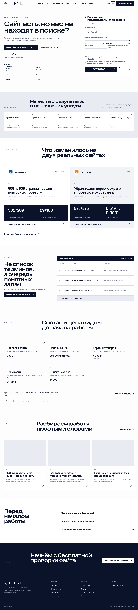 | 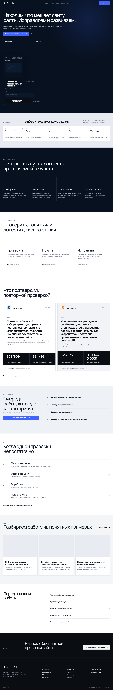 |

**Было:** светлый первый экран с крупным текстом и полной формой; цены появлялись рано, а повторяющиеся прямоугольные секции конкурировали за внимание.

**Стало:** тёмный технический hero с картой обхода, коротким обещанием результата и двухшаговой формой. Сначала пользователь видит задачу, метод и доказательства; цены доступны позже через услуги и отдельную категорийную страницу. CTA ведёт к реальной проверке, а не к декоративной демонстрации.

Отдельный итоговый снимок hero: [`hero-desktop.png`](./redesign-screenshots/after/hero-desktop.png).

## Mobile: структура вместо уменьшенной desktop-ленты

| До | После |
| --- | --- |
|  |  |

**Было:** длинная последовательность блоков, рассчитанных прежде всего на desktop, и форма, занимавшая большую часть первого экрана.

**Стало:** адаптивный hero, управляемое мобильное меню, последовательное раскрытие формы и отдельная раскладка карточек. Автоматическая проверка конечной высоты подтверждает отсутствие бесконечного роста страницы и горизонтального скролла.

## Цены: от общей длинной ленты к выбору направления

| До | После |
| --- | --- |
|  | 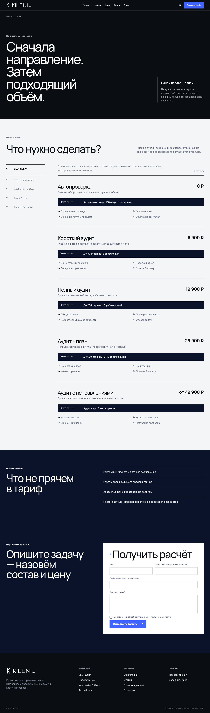 |

**Было:** все услуги и тарифы шли подряд; пользователю приходилось читать предложения, не относящиеся к его задаче.

**Стало:** шесть категорий — SEO-аудит, SEO-продвижение, разработка, Яндекс Реклама, контент и индивидуальная задача. Внутри категории цена показана рядом с пределом и составом. Утверждённые рублёвые суммы сохранены и берутся из `src/config/prices.ts`; автоматический пересчёт EN-цен без подтверждённой валюты и коэффициента отключён. Wildberries и Ozon вынесены в отдельный специализированный раздел с выбором площадки и собственными пакетами.

## Кейсы: от текстовой сводки к доказательному сценарию

| До | После |
| --- | --- |
| 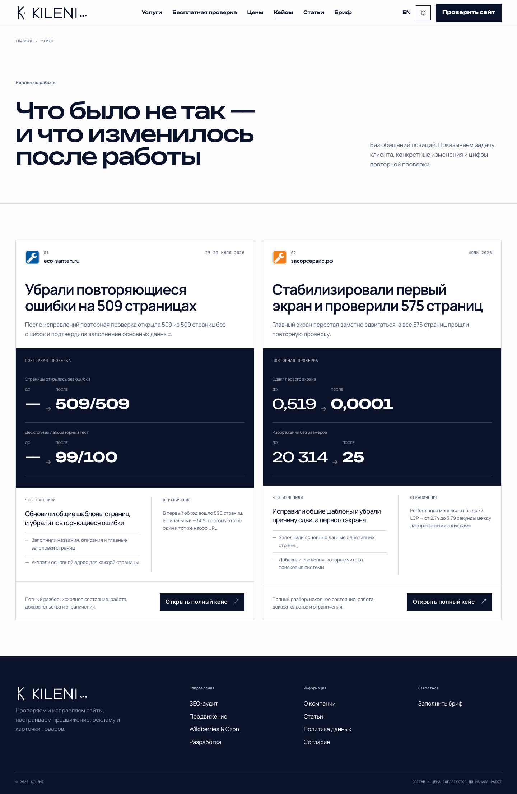 | 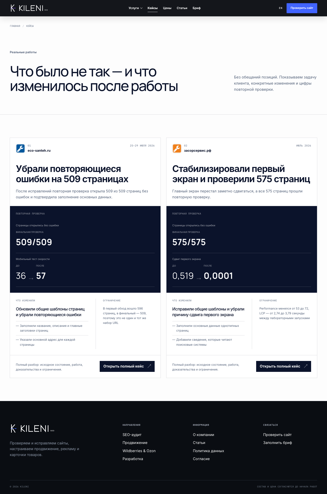 |

**Было:** два ряда с заголовками и цифрами без достаточного объяснения задачи, сделанной работы и ограничений.

**Стало:** две самостоятельные истории с логотипами исходных сайтов, задачей, списком работ, доказательством повторной проверки и явными ограничениями. Для `eco-santeh.ru` показаны 509/509 открывшихся страниц и 35 → 93 по внутренней шкале технической готовности. Для `засорсервис.рф` — 575/575 и подтверждённый CLS 0,519 → 0,0001; финальные показатели без сопоставимого baseline подписываются как финальная проверка, а не как выдуманное «до».

Подробные состояния:

- [`case-eco-santeh.png`](./redesign-screenshots/after/case-eco-santeh.png);
- [`case-zasorservice.png`](./redesign-screenshots/after/case-zasorservice.png).

## Бриф: от анкеты к маршруту подготовки предложения

| До | После |
| --- | --- |
| 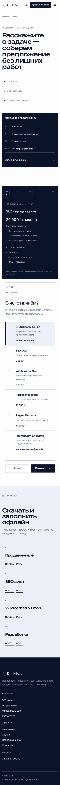 | 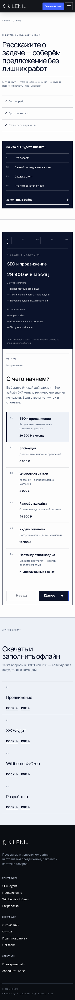 |

**Было:** длинный набор полей; до заполнения было трудно понять, что именно клиент получит и от чего зависит цена.

**Стало:** пять стадий от выбора задачи до подтверждения. Компас слева или сверху показывает выбранную услугу, стартовую цену, состав и подготовку. Обязательные вопросы отделены от необязательных, черновик хранится в браузере, перед отправкой есть сводка. Можно приложить до 5 файлов или скачать один из 16 подготовленных DOCX/PDF-брифов на RU/EN.

Desktop-состояние: [`brief-desktop.png`](./redesign-screenshots/after/brief-desktop.png).

## Статьи: от одинаковых карточек к редакционной библиотеке

| До | После |
| --- | --- |
| 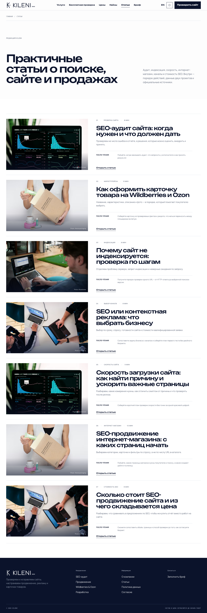 | 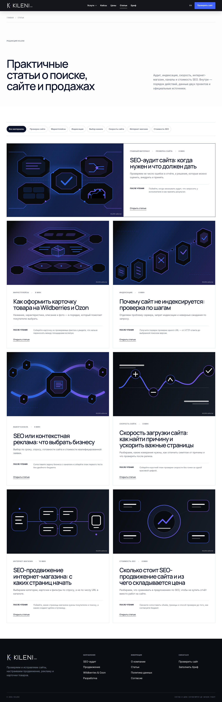 |

**Было:** одинаковая сетка материалов с тяжёлыми карточками и слабым различием между темами.

**Стало:** один featured-материал, фильтры по теме, семь двуязычных статей и семь самостоятельных локальных SVG-обложек. Внутри статьи есть оглавление, практические секции, FAQ, связанные материалы и первичные источники. Числовые данные Wordstat не выдумываются: без авторизованного официального интерфейса используются только проверяемая методика и источники.

Пример статьи: [`article-desktop.png`](./redesign-screenshots/after/article-desktop.png).

## Новые самостоятельные разделы и состояния

Для этих экранов отдельные снимки «до» не сохранились, поэтому они приведены как доказательства итогового состояния, без искусственной визуальной пары.

### Wildberries и Ozon

- [`marketplace-overview-desktop.png`](./redesign-screenshots/after/marketplace-overview-desktop.png) — общий экран направления с явным выбором площадки;
- [`marketplace-wildberries-desktop.png`](./redesign-screenshots/after/marketplace-wildberries-desktop.png) — самостоятельная карточка Wildberries с задачами, визуальной системой и пакетами;
- [`marketplace-wildberries-offers.png`](./redesign-screenshots/after/marketplace-wildberries-offers.png) — состав и границы предложений для выбранной площадки.

### Глоссарий и объяснение процесса

- [`glossary-desktop.png`](./redesign-screenshots/after/glossary-desktop.png) — словарь терминов с короткими объяснениями без перегрузки основной страницы;
- [`process-four-steps-desktop.png`](./redesign-screenshots/after/process-four-steps-desktop.png) — четыре последовательных шага работы;
- [`cookie-banner-desktop.png`](./redesign-screenshots/after/cookie-banner-desktop.png) — компактное согласие на cookies и локальные настройки.

## Три темы: Light, Dark и Signal

До редизайна сопоставимых снимков трёх переключаемых тем не было. Ниже — фактические итоговые состояния одной главной страницы на desktop и mobile.

| Тема | Desktop 1440 px | Mobile 390 px |
| --- | --- | --- |
| Light | 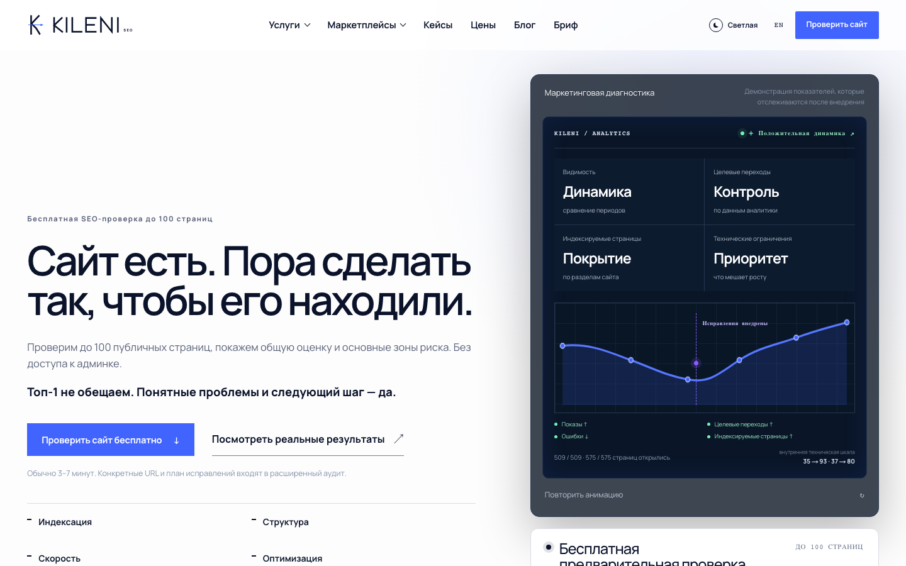 |  |
| Dark | 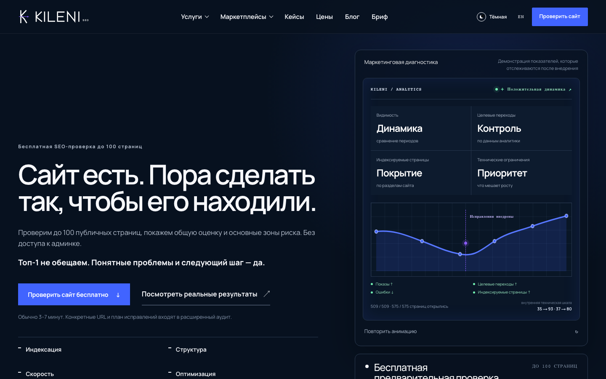 |  |
| Signal | 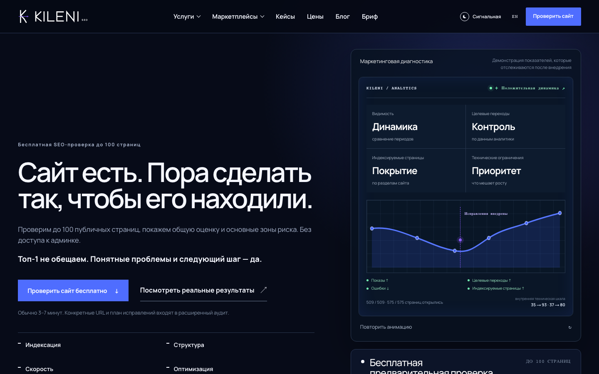 |  |

## Английская версия: та же структура без неподтверждённого курса

| До | После |
| --- | --- |
| 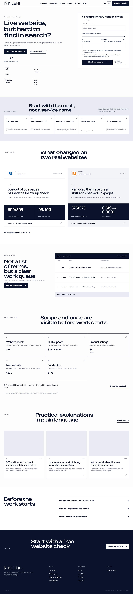 | 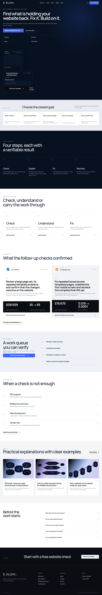 |

**Было:** английская версия визуально и текстово расходилась с русской; цены могли зависеть от fallback-пересчёта.

**Стало:** те же маршруты, порядок блоков, кейсы, статьи и состояния формы. Переключение языка сохраняет текущий публичный путь. Если владелец не задал `NEXT_PUBLIC_EN_PRICE_CURRENCY` и `NEXT_PUBLIC_EN_PRICE_RATE`, интерфейс показывает `Individual estimate`, а не придуманную сумму.

## Бесплатная проверка и результат

Прямой скриншот до редизайна для результата не зафиксирован, поэтому эта часть не оформляется как визуальная пара.

Итоговые состояния:

- [`free-audit.png`](./redesign-screenshots/after/free-audit.png) — отдельная страница с честным составом и ограничениями;
- [`audit-progress.png`](./redesign-screenshots/after/audit-progress.png) — реальный прогресс, сетевой scan и стадии обхода;
- [`audit-result.png`](./redesign-screenshots/after/audit-result.png) — сокращённый публичный результат, PDF и следующие шаги.

Ключевые изменения:

- лимит задаётся сервером — до 100 публичных страниц;
- пользовательский ползунок лимита удалён;
- фейковые отзывы и счётчик использований удалены;
- страница прогресса получает наблюдаемые данные обхода, а не случайную анимацию;
- публичный результат не раскрывает контакт, точные URL, полный список ошибок и инструкции;
- после результата есть скидка 25% на первый платный аудит без таймера и искусственной срочности;
- ошибочный, истёкший или неподписанный восстановительный параметр не открывает результат.

## Что сохранено

| Контур | Сохранённая рабочая часть |
| --- | --- |
| Архитектура | Next.js App Router, публичные RU/EN-маршруты, metadata, sitemap, robots и schema |
| Аудит | URL-валидация и SSRF-защита, robots.txt, sitemap, crawler, очередь, SSE/polling, публичный token и PDF |
| Данные | SQLite-модели заявок, аудитов и брифов; admin-сценарии и экспорты |
| Формы | CSRF, rate limit, Turnstile, honeypot, согласия, атрибуция и приватное хранение вложений |
| Бренд | Знак KILENI и первое появление логотипа; reduced motion и возможность прервать интро вводом |
| Контент | Подтверждённые кейсы и их ограничения, централизованные цены, полезные материалы RU/EN |

## Что сознательно не добавлено

- выдуманные отзывы, награды, команда, годы работы и количество клиентов;
- счётчик «сколько человек воспользовались» без очищенной реальной аналитики;
- гарантии позиций, трафика, заявок или продаж;
- юридическое имя, адрес, ИНН, e-mail и публичные контакты-заглушки;
- автоматические EN-цены по неподтверждённому курсу;
- выдуманные частотности Wordstat.

## Проверка итогового состояния

Автоматический визуальный отчёт [`visual-qa.json`](./redesign-screenshots/after/visual-qa.json) содержит 363 пройденные проверки из 363 на восьми размерах от 320 до 1440 px. Для проверенных публичных маршрутов подтверждены:

- HTTP 200;
- ровно один H1;
- отсутствие горизонтального переполнения;
- конечная высота документа и достижимость footer;
- открытие и закрытие мобильного меню;
- наличие формы и scan-визуала на главной;
- отдельные состояния прогресса и результата аудита.

Дополнительный отчёт по новым состояниям [`visual-evidence-qa.json`](./redesign-screenshots/after/visual-evidence-qa.json) содержит 14 пройденных проверок из 14. Повторно проверены desktop 1440 px и mobile 390 px для трёх тем, маркетплейсов, глоссария и четырёхшагового процесса: везде один H1, нет горизонтального переполнения, ошибок консоли и необработанных ошибок страницы.

Функциональные сценарии находятся в `tests/e2e/public-pages.spec.ts`, `tests/e2e/free-audit-social-proof.spec.ts`, `tests/e2e/cases-brief-refinement.spec.ts`, `tests/e2e/articles-10.spec.ts` и `tests/e2e/home-10.spec.ts`.

Финальный Lighthouse production-сборки в профиле публичного запуска:

- mobile: Performance 96, Accessibility 100, Best Practices 100, SEO 100, FCP 1,21 с, LCP 2,81 с, TBT 43 мс, CLS 0;
- desktop: Performance 99, Accessibility 100, Best Practices 100, SEO 100, FCP 0,29 с, LCP 0,70 с, TBT 0 мс, CLS 0.

Исходные JSON-отчёты launch-профиля: [`mobile`](./redesign-screenshots/after/lighthouse-home-launch-mobile.json) и [`desktop`](./redesign-screenshots/after/lighthouse-home-launch-desktop.json).

Безопасный prelaunch-профиль проверен отдельно:

- mobile: Performance 96, Accessibility 100, Best Practices 100, SEO 69, FCP 1,21 с, LCP 2,67 с, TBT 54 мс, CLS 0;
- desktop: Performance 100, Accessibility 100, Best Practices 100, SEO 69, FCP 0,29 с, LCP 0,59 с, TBT 0 мс, CLS 0.

SEO 69 в prelaunch — ожидаемый результат: `PRELAUNCH_MODE=true` добавляет глобальный `noindex`, пока не заполнены и не проверены юридические данные. Это не смешивается с индексируемым launch-профилем, где SEO = 100. Исходные JSON-отчёты prelaunch-профиля: [`mobile`](./redesign-screenshots/after/lighthouse-home-mobile.json) и [`desktop`](./redesign-screenshots/after/lighthouse-home-desktop.json).

## Данные, необходимые перед публичным запуском форм

Редизайн завершает интерфейс, но не подменяет отсутствующие бизнес-данные. До production-запуска владелец должен задать юридическое имя, адрес, ИНН, юридический e-mail и подтверждённые публичные контакты. Если нужны числовые EN-цены, также требуются утверждённая валюта и коэффициент. При включённых production-формах отсутствие обязательных legal-полей должно останавливать launch validation.
